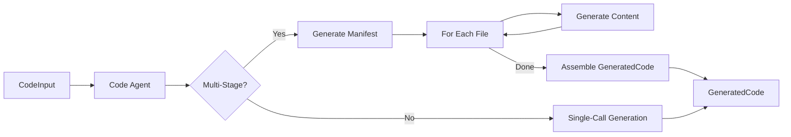

# Code Agent - User Guide

**Version:** 1.0.0
**Last Updated:** November 17, 2025
**Status:** Production Ready

## Table of Contents

1. [Overview](#overview)
2. [Key Features](#key-features)
3. [Architecture](#architecture)
4. [Quick Start](#quick-start)
5. [Generation Modes](#generation-modes)
6. [Multi-Stage Generation](#multi-stage-generation)
7. [Usage Examples](#usage-examples)
8. [Performance & Cost](#performance--cost)
9. [Troubleshooting](#troubleshooting)
10. [API Reference](#api-reference)

---

## Overview

The Code Agent transforms approved `DesignSpecification` objects into production-ready code. It is responsible for implementing the system logic, writing unit tests, adding documentation, and ensuring the code structure follows industry standards and specific project guidelines.

### Core Responsibilities

1.  **Code Generation:** Implementing all components defined in the design spec.
2.  **Test Generation:** Writing unit tests for the generated code.
3.  **Documentation:** Adding docstrings and implementation notes.
4.  **Structure Management:** Organizing files into the correct directory structure.
5.  **Multi-Stage Processing:** Managing large codebases via a manifest-based generation process to avoid token limits and formatting errors.

---

## Key Features

-   **Full-Stack Generation:** Creates source code, tests, configuration files, and documentation.
-   **Traceability:** Links generated files back to Semantic Units (from Planning) and Components (from Design).
-   **Multi-Stage Mode:** A robust generation strategy that first creates a file manifest and then generates each file individually, ensuring high quality and bypassing context window limits.
-   **Artifact Persistence:** Automatically saves generated code to `artifacts/{task_id}/generated_code/` and commits to Git.
-   **Telemetry:** Tracks lines of code (LOC), token usage, and generation time.

---

## Architecture

The Code Agent takes `CodeInput` (containing the design spec and standards) and produces `GeneratedCode`.



---

## Quick Start

### Basic Usage

```python
from asp.agents.code_agent import CodeAgent
from asp.models.code import CodeInput
from asp.models.design import DesignSpecification

# 1. Initialize the agent (enable multi-stage for best results)
agent = CodeAgent(use_multi_stage=True)

# 2. Prepare input
# Assume design_spec comes from DesignAgent output
input_data = CodeInput(
    task_id="TASK-2025-001",
    design_specification=design_spec,
    coding_standards="Use Python 3.10+, Pydantic v2, and pytest."
)

# 3. Execute generation
code = agent.execute(input_data)

# 4. Inspect results
print(f"Generated {code.total_files} files.")
print(f"Total LOC: {code.total_lines_of_code}")
print(f"Files stored in: artifacts/{code.task_id}/generated_code/")
```

---

## Generation Modes

The agent supports two modes of operation, controlled by the `use_multi_stage` parameter or `ASP_MULTI_STAGE_CODE_GEN` environment variable.

### 1. Multi-Stage Mode (Recommended)
**Setting:** `use_multi_stage=True` or `ASP_MULTI_STAGE_CODE_GEN=true`

This mode splits the task into two phases:
1.  **Manifest Generation:** The LLM lists all files to be created, their purpose, and dependencies. This returns a small JSON object.
2.  **Content Generation:** The agent iterates through the manifest and asks the LLM to generate the raw content for each file individually.

**Pros:**
-   Avoids JSON parsing errors for large code blocks.
-   Handling of large projects (unlimited total LOC, only limited by per-file size).
-   Better quality control per file.

**Cons:**
-   Takes longer to execute (linear time with respect to file count).
-   Higher API cost (more prompts).

### 2. Single-Call Mode (Legacy)
**Setting:** `use_multi_stage=False` (Default)

This mode asks the LLM to generate all files and content in a single massive JSON response.

**Pros:**
-   Faster for very small tasks.
-   Lower API cost.

**Cons:**
-   Prone to JSON syntax errors (escaping quotes/newlines).
-   Hard limit on total output size (context window).
-   Lower quality for complex files.

---

## Multi-Stage Generation

The multi-stage process is the default recommendation for production use.

### Phase 1: File Manifest
The agent generates a `FileManifest` containing:
-   List of files to create.
-   File types (Python, HTML, SQL, etc.).
-   Description of each file's responsibility.
-   Estimated lines of code.

### Phase 2: File Content
For each file in the manifest, the agent:
1.  Constructs a specific prompt with the file's metadata and the relevant parts of the design spec.
2.  Requests **raw text** output (not JSON) to ensure code integrity.
3.  Validates the content is not empty.
4.  Retries up to 3 times if generation fails.

---

## Usage Examples

### Custom Coding Standards

You can enforce specific patterns via the `coding_standards` field.

```python
standards = """
1. Use snake_case for functions and variables.
2. All public functions must have docstrings in Google style.
3. Use `pathlib` instead of `os.path`.
4. Max line length is 88 (Black style).
"""

input_data = CodeInput(
    task_id="TASK-002",
    design_specification=design_spec,
    coding_standards=standards
)

agent.execute(input_data)
```

### Accessing Generated Files

Files are returned in the `GeneratedCode` object and also written to disk.

```python
# Access in memory
for file in code.files:
    if file.file_path.endswith("main.py"):
        print(file.content)

# Access on disk
import os
path = f"artifacts/{code.task_id}/generated_code/src/main.py"
if os.path.exists(path):
    with open(path) as f:
        print(f.read())
```

---

## Performance & Cost

-   **Execution Time:**
    -   Single-Call: 30-60 seconds.
    -   Multi-Stage: 1-5 minutes (depending on file count).
-   **LLM Model:** Claude 3.5 Sonnet (`claude-sonnet-4-20250514`).
-   **Cost:**
    -   Single-Call: ~$0.10 - $0.20 per run.
    -   Multi-Stage: ~$0.05 per file generated + $0.05 for manifest.
    -   Example: A 10-file project costs ~$0.55.

---

## Troubleshooting

### Common Issues

#### 1. `AgentExecutionError: Failed to parse JSON`
**Mode:** Single-Call
**Cause:** The LLM generated a JSON string with unescaped characters (usually in code comments or strings).
**Solution:** Switch to Multi-Stage mode (`use_multi_stage=True`).

#### 2. `AgentExecutionError: Generated content is too short`
**Mode:** Multi-Stage
**Cause:** The LLM returned an empty or truncated response for a specific file.
**Solution:** The agent automatically retries 3 times. If it still fails, check the logs for the specific file error. The prompt might be too restrictive or the input design too vague.

#### 3. Duplicate File Paths
**Error:** `Duplicate file paths found`
**Cause:** The LLM output the same filename twice in the manifest or single-call response.
**Solution:** This is a rare hallucination. Retry the execution.

---

## API Reference

### `CodeAgent`

```python
class CodeAgent(BaseAgent):
    def __init__(self, use_multi_stage: bool | None = None, ...):
        """
        Args:
            use_multi_stage: Enable robust multi-stage generation.
        """

    def execute(self, input_data: CodeInput) -> GeneratedCode:
        """
        Generates code based on design spec.
        """
```

### `GeneratedCode`

```python
class GeneratedCode(BaseModel):
    task_id: str
    files: list[GeneratedFile]
    total_lines_of_code: int
    file_structure: dict[str, list[str]]
    # ...
```

### `GeneratedFile`

```python
class GeneratedFile(BaseModel):
    file_path: str
    content: str
    file_type: str
    component_id: str | None
    # ...
```
