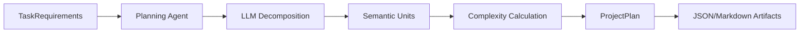

# Planning Agent - User Guide

**Version:** 1.0.0
**Last Updated:** November 16, 2025
**Status:** Production Ready

## Table of Contents

1. [Overview](#overview)
2. [Key Features](#key-features)
3. [Architecture](#architecture)
4. [Quick Start](#quick-start)
5. [Task Decomposition](#task-decomposition)
6. [PROBE-AI Estimation](#probe-ai-estimation)
7. [Usage Examples](#usage-examples)
8. [Performance & Cost](#performance--cost)
9. [Troubleshooting](#troubleshooting)
10. [API Reference](#api-reference)

---

## Overview

The Planning Agent is the first agent in the ASP (Agentic Software Process) pipeline. It is responsible for taking high-level task requirements and breaking them down into measurable, actionable "Semantic Units." It also calculates the semantic complexity of each unit using the C1 complexity formula, setting the stage for accurate effort estimation.

### Core Responsibilities

1.  **Task Decomposition:** Breaking vague or high-level requirements into specific, implementable units.
2.  **Complexity Scoring:** Assigning a complexity score to each unit based on API interactions, data transformations, logical branches, and other factors.
3.  **PROBE-AI Estimation:** (Phase 2) Using historical data to estimate development effort.
4.  **Feedback Integration:** refining the plan based on feedback from the Design Review agent.

---

## Key Features

-   **Deterministic Decomposition:** Uses structured prompts to ensure consistent breakdown of tasks.
-   **Semantic Complexity (C1):** A quantifiable metric for code complexity (PRD Section 13.1).
-   **Feedback Loop:** Capable of re-planning when downstream agents (like Design Review) identify issues in the requirements or scope.
-   **Artifact Persistence:** Automatically saves plans as JSON and Markdown, and commits them to Git.
-   **Telemetry:** Full integration with Langfuse and SQLite for cost and performance tracking.

---

## Architecture

The Planning Agent operates as a `BaseAgent` subclass, utilizing the `TaskRequirements` model as input and producing a `ProjectPlan`.



### PROBE-AI Integration
In Phase 2, the Planning Agent will query historical performance data (PROBE) to provide data-driven estimates for the effort required to complete the task. Currently (Phase 1), it focuses on accurate decomposition and complexity scoring.

---

## Quick Start

### Basic Usage

```python
from asp.agents.planning_agent import PlanningAgent
from asp.models.planning import TaskRequirements

# 1. Initialize the agent
agent = PlanningAgent()

# 2. Define requirements
requirements = TaskRequirements(
    task_id="TASK-2025-001",
    description="Build user authentication system",
    requirements="Support JWT tokens, user registration, and login endpoints.",
    context_files=["docs/auth_spec.md"] # Optional context
)

# 3. Execute planning
plan = agent.execute(requirements)

# 4. Inspect results
print(f"Task ID: {plan.task_id}")
print(f"Semantic Units: {len(plan.semantic_units)}")
print(f"Total Complexity: {plan.total_est_complexity}")

for unit in plan.semantic_units:
    print(f"- {unit.description} (Complexity: {unit.est_complexity})")
```

---

## Task Decomposition

The agent breaks down tasks into **Semantic Units**. A Semantic Unit is a distinct, testable piece of functionality.

### Anatomy of a Semantic Unit

Each unit contains:
-   **Unit ID:** Unique identifier (e.g., `SU-001`).
-   **Title:** Descriptive name.
-   **Description:** Detailed explanation of the unit's purpose.
-   **Complexity Factors:**
    -   `api_interactions`: Number of external API calls or endpoints.
    -   `data_transformations`: Number of data structure changes.
    -   `logical_branches`: Estimate of cyclomatic complexity (if/else paths).
    -   `code_entities_modified`: Number of classes/functions touched.
    -   `novelty_multiplier`: Factor for unfamiliarity (1.0 = standard, 1.5 = high).

---

## PROBE-AI Estimation

**Status:** Phase 2 Implementation (Pending)

The PROBE-AI system aims to replace gut-feel estimation with data science.
1.  **Historical Data:** The system tracks how long similar Semantic Units took to implement in the past.
2.  **Regression Analysis:** It uses the C1 complexity score as a predictor for time-to-complete.
3.  **Prediction:** The Planning Agent will return a `probe_ai_prediction` field in the `ProjectPlan` containing the estimated hours.

*Note: In the current version (1.0.0), `probe_ai_prediction` will be `None`.*

---

## Usage Examples

### Re-planning with Feedback

If the Design Review agent finds that the plan missed a security requirement, it sends feedback to the Planning Agent.

```python
from asp.models.design_review import DesignIssue

# Simulate feedback from Design Review
feedback = [
    DesignIssue(
        issue_id="ISSUE-001",
        affected_phase="Planning",
        severity="High",
        description="Missing requirement for password hashing.",
        evidence="Requirements doc",
        impact="Security vulnerability"
    )
]

# Execute with feedback
revised_plan = agent.execute(requirements, feedback=feedback)

# The revised plan will now include semantic units for password hashing
```

---

## Performance & Cost

-   **Execution Time:** Typically 5-15 seconds.
-   **LLM Model:** Claude 3.5 Sonnet (`claude-sonnet-4-20250514`).
-   **Cost:**
    -   ~500-1000 input tokens (depending on context files).
    -   ~500-1000 output tokens (depending on number of units).
    -   Estimated cost: < $0.05 per run.

---

## Troubleshooting

### Common Issues

#### 1. `AgentExecutionError: LLM returned non-JSON response`
**Cause:** The LLM failed to follow the strict JSON output format.
**Solution:** Retry the execution. The agent is deterministic (`temperature=0.0`), but occasional format slips happen. If persistent, check if `requirements` text contains confusing characters or unescaped quotes.

#### 2. Complexity Mismatch Warning
**Log:** `Unit SU-XX: Complexity mismatch. LLM reported X, calculated Y. Using calculated value.`
**Cause:** The LLM's math for the C1 formula was slightly off.
**Solution:** This is self-correcting. The agent automatically recalculates the complexity using the deterministic formula based on the factors provided by the LLM. You can ignore this warning.

---

## API Reference

### `PlanningAgent`

```python
class PlanningAgent(BaseAgent):
    def execute(self, input_data: TaskRequirements, feedback: list | None = None) -> ProjectPlan:
        """
        Decomposes task into semantic units.

        Args:
            input_data: Task requirements and context.
            feedback: Optional list of DesignIssue objects for re-planning.

        Returns:
            ProjectPlan containing semantic units and complexity scores.
        """
```

### `TaskRequirements`

```python
class TaskRequirements(BaseModel):
    task_id: str
    description: str
    requirements: str
    project_id: str | None = None
    context_files: list[str] | None = None
```

### `ProjectPlan`

```python
class ProjectPlan(BaseModel):
    task_id: str
    semantic_units: list[SemanticUnit]
    total_est_complexity: float
    probe_ai_prediction: float | None
    # ...
```
