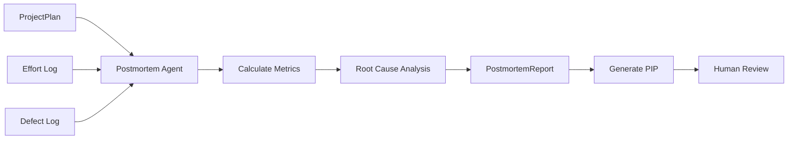

# Postmortem Agent - User Guide

**Version:** 1.0.0
**Last Updated:** November 19, 2025
**Status:** Production Ready

## Table of Contents

1. [Overview](#overview)
2. [Key Features](#key-features)
3. [Architecture](#architecture)
4. [Quick Start](#quick-start)
5. [Performance Metrics](#performance-metrics)
6. [Root Cause Analysis (RCA)](#root-cause-analysis-rca)
7. [Process Improvement (PIP)](#process-improvement-pip)
8. [Usage Examples](#usage-examples)
9. [Performance & Cost](#performance--cost)
10. [Troubleshooting](#troubleshooting)
11. [API Reference](#api-reference)

---

## Overview

The Postmortem Agent is a meta-agent that runs after task completion. Its purpose is not to modify the code, but to **improve the process**. It analyzes the telemetry data, defect logs, and estimated-vs-actual metrics to generate a Postmortem Report and a Process Improvement Proposal (PIP).

### Core Responsibilities

1.  **Performance Analysis:** Comparing the `ProjectPlan` estimates against actual execution logs (time, tokens, cost).
2.  **Quality Metrics:** Calculating defect density, phase yield (percentage of defects caught in the same phase they were injected), and total fix effort.
3.  **Root Cause Analysis:** Identifying which types of defects caused the most pain (cost/time).
4.  **PIP Generation:** Proposing specific changes to agent prompts or checklists to prevent recurrence.

---

## Key Features

-   **Automated Retrospective:** Performs a consistent, data-driven "retro" for every single task.
-   **Estimation Accuracy:** Tracks how well the Planning Agent predicted the effort.
-   **Phase Yield Tracking:** Identifies which phase (Design Review, Code Review, Test) is letting defects slip through.
-   **Self-Healing Process:** Generates actionable proposals (PIPs) to update system prompts, effectively allowing the system to "learn" from its mistakes.
-   **Artifact Persistence:** Saves reports and proposals to JSON/Markdown for human review.

---

## Architecture

The Postmortem Agent takes a `PostmortemInput` containing the original plan and all execution logs, and outputs a `PostmortemReport`.



---

## Quick Start

### Basic Usage

```python
from asp.agents.postmortem_agent import PostmortemAgent
from asp.models.postmortem import PostmortemInput

# 1. Initialize the agent
agent = PostmortemAgent()

# 2. Gather data (usually done by the Orchestrator)
input_data = PostmortemInput(
    task_id="TASK-2025-001",
    project_plan=original_plan,
    effort_log=all_telemetry_entries,
    defect_log=all_defects,
    actual_semantic_complexity=25.0
)

# 3. Run analysis
report = agent.execute(input_data)

# 4. Generate Improvement Proposal
pip = agent.generate_pip(report, input_data)

# 5. Review findings
print(f"Estimation Variance: {report.estimation_accuracy.latency_ms.variance_percent}%")
print(f"Top Root Cause: {report.root_cause_analysis[0].defect_type}")
print(f"Proposed Change: {pip.proposed_changes[0].description}")
```

---

## Performance Metrics

The agent calculates `EstimationAccuracy` by comparing planned vs. actuals for:
-   **Latency (ms):** Wall-clock time.
-   **Tokens:** LLM usage.
-   **API Cost:** Dollar cost.
-   **Semantic Complexity:** Expected vs. implemented complexity.

A variance of **±20%** is considered "on target".

---

## Root Cause Analysis (RCA)

The agent groups defects by the `DefectType` taxonomy (e.g., `10_Documentation`, `80_Function`) and calculates:
-   **Occurrence Count:** How often it happened.
-   **Total Effort to Fix:** Sum of the cost/time spent fixing this specific type of defect.

It returns a sorted list, highlighting the "expensive" problems rather than just the frequent ones.

---

## Process Improvement (PIP)

The **Process Improvement Proposal (PIP)** is a structured JSON object suggesting changes.

### PIP Structure
-   **Target Artifact:** The file to change (e.g., `prompts/design_agent.yaml`).
-   **Change Type:** `ADD`, `MODIFY`, or `REMOVE`.
-   **Description:** Why the change is needed.
-   **Content:** The actual text to insert or modify.

**Example PIP:**
> "Modify `coding_agent.yaml` to include a check for 'SQL Injection' in the self-review step, because 3 Security Vulnerability defects were found in the last task."

---

## Usage Examples

### Detecting Process Drift

If the `defect_density` (defects per complexity unit) starts rising, the Postmortem report will highlight this trend.

```python
if report.quality_metrics.defect_density > 0.5:
    print("Quality Alert: Defect density is high.")
```

### Analyzing Phase Leakage

If defects injected in "Design" are only being caught in "Test", the Design Review phase has poor yield.

```python
design_yield = report.quality_metrics.phase_yield.get("Design", 0)
if design_yield < 80.0:
    print("Process Alert: Design Review is missing too many issues.")
```

---

## Performance & Cost

-   **Execution Time:** 10-20 seconds.
-   **LLM Model:** Claude 3.5 Sonnet.
-   **Cost:** ~$0.05 per run.
-   **Data Usage:** Requires access to the full telemetry database for the task.

---

## Troubleshooting

### Common Issues

#### 1. `Variance is 0.0%` (Suspicious)
**Cause:** If PROBE-AI is disabled (Phase 1), planned values are 0, making comparison impossible.
**Solution:** This is expected behavior in Phase 1. The variance is technically undefined/zero.

#### 2. `Failed to generate PIP`
**Cause:** The LLM failed to structure the proposal as valid JSON.
**Solution:** Retry. Ensure the input report contains meaningful defect data; if there were 0 defects, the agent might struggle to "improve" a perfect process.

---

## API Reference

### `PostmortemAgent`

```python
class PostmortemAgent(BaseAgent):
    def execute(self, input_data: PostmortemInput) -> PostmortemReport:
        """
        Analyzes performance.
        """

    def generate_pip(self, report: PostmortemReport, ...) -> ProcessImprovementProposal:
        """
        Proposes process changes.
        """
```

### `PostmortemReport`

```python
class PostmortemReport(BaseModel):
    task_id: str
    estimation_accuracy: EstimationAccuracy
    quality_metrics: QualityMetrics
    root_cause_analysis: list[RootCauseItem]
    recommendations: list[str]
    # ...
```

### `ProcessImprovementProposal`

```python
class ProcessImprovementProposal(BaseModel):
    proposal_id: str
    proposed_changes: list[ProposedChange]
    hitl_status: Literal["PENDING", "APPROVED", "REJECTED"]
    # ...
```
