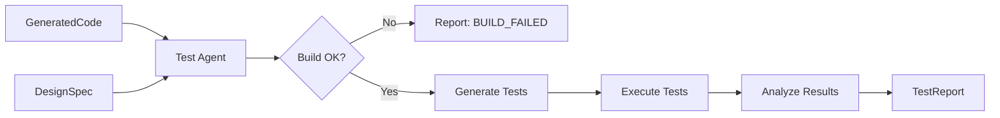

# Test Agent - User Guide

**Version:** 1.0.0
**Last Updated:** November 19, 2025
**Status:** Production Ready

## Table of Contents

1. [Overview](#overview)
2. [Key Features](#key-features)
3. [Architecture](#architecture)
4. [Quick Start](#quick-start)
5. [Test Generation Strategies](#test-generation-strategies)
6. [Defect Taxonomy](#defect-taxonomy)
7. [Usage Examples](#usage-examples)
8. [Performance & Cost](#performance--cost)
9. [Troubleshooting](#troubleshooting)
10. [API Reference](#api-reference)

---

## Overview

The Test Agent is responsible for validating the code produced by the Coding Agent. It does not simply run existing tests; it **generates** new, comprehensive unit tests based on the original design specification, executes them, and reports on the results. It serves as the primary quality gate before code can be accepted.

### Core Responsibilities

1.  **Build Validation:** Verifying that the code parses and compiles (if applicable).
2.  **Test Generation:** Creating unit tests that target the specific requirements and edge cases defined in the design.
3.  **Test Execution:** Running the test suite and capturing stdout/stderr.
4.  **Defect Reporting:** Logging defects with a standardized taxonomy (PROBE/PSP).

---

## Key Features

-   **Autonomous Test Writing:** Writes standard `pytest` test cases without human intervention.
-   **Design-Driven Testing:** Tests are derived from the *Design Specification*, not just the implementation, ensuring the code meets requirements.
-   **AI Defect Taxonomy:** Automatically classifies failures into types like `10_Documentation`, `20_Syntax`, `60_Checking`, etc.
-   **Coverage Analysis:** Tracks code coverage percentage against the project target (default 80%).
-   **Artifact Persistence:** Saves test reports (JSON/Markdown) and commits them to Git.

---

## Architecture

The Test Agent accepts `TestInput` (Generated Code + Design Spec) and returns a `TestReport`.



---

## Quick Start

### Basic Usage

```python
from asp.agents.test_agent import TestAgent
from asp.models.test import TestInput

# 1. Initialize the agent
agent = TestAgent()

# 2. Prepare input
# Assume code comes from CodeAgent, design from DesignAgent
input_data = TestInput(
    task_id="TASK-2025-001",
    generated_code=code_object,
    design_specification=design_spec,
    test_framework="pytest",
    coverage_target=80.0
)

# 3. Execute testing
report = agent.execute(input_data)

# 4. Check results
if report.test_status == "PASS":
    print("All tests passed!")
else:
    print(f"Tests failed: {report.test_summary['failed']} failures.")
    for defect in report.defects_found:
        print(f"- [{defect.severity}] {defect.description}")
```

---

## Test Generation Strategies

The agent employs several strategies to ensure robust testing:

1.  **Happy Path:** Verifying standard usage scenarios described in the design.
2.  **Edge Cases:** Testing boundary conditions (empty inputs, max values, nulls).
3.  **Error Handling:** Ensuring the code raises the correct exceptions for invalid inputs.
4.  **Integration Points:** Mocking external dependencies to test logic in isolation.

The agent defaults to using `pytest` fixtures and parametrization to keep tests clean and maintainable.

---

## Defect Taxonomy

When a test fails, the agent classifies the defect using the PSP (Personal Software Process) taxonomy to enable PROBE analysis.

| Code | Type | Description |
| :--- | :--- | :--- |
| **10** | Documentation | Comments, messages, naming. |
| **20** | Syntax | Spelling, punctuation, typos, instruction formats. |
| **30** | Build/Package | Change management, library issues. |
| **40** | Assignment | Declaration, duplicate names, scope. |
| **50** | Interface | Procedure calls, references, I/O. |
| **60** | Checking | Error messages, inadequate checks. |
| **70** | Data | Structure, content. |
| **80** | Function | Logic, pointers, loops, recursion, computation. |
| **90** | System | Configuration, timing, memory. |
| **100** | Environment | Design, compile, test tools. |

---

## Usage Examples

### Handling Build Failures

If the code fails to interpret or compile, the agent returns a `BUILD_FAILED` status immediately.

```python
if report.test_status == "BUILD_FAILED":
    print("Critical: Code did not even run.")
    # The 'defects_found' list will contain the syntax error details.
```

### Analyzing Coverage

```python
print(f"Coverage: {report.coverage_percentage}%")
if report.coverage_percentage < input_data.coverage_target:
    print("Warning: Coverage target not met.")
```

---

## Performance & Cost

-   **Execution Time:** 30-90 seconds (includes test generation and execution simulation).
-   **LLM Model:** Claude 3.5 Sonnet.
-   **Cost:** ~$0.10 - $0.20 per run.
-   **Token Usage:** High context usage due to reading both full code implementation and design specs.

---

## Troubleshooting

### Common Issues

#### 1. `AgentExecutionError: LLM returned non-JSON response`
**Cause:** The LLM output raw text instead of the JSON report format.
**Solution:** Retry. The `temperature=0.0` setting minimizes this, but large test outputs can sometimes confuse the model's formatting.

#### 2. `Invalid test status` Error
**Cause:** Inconsistency between the boolean `build_successful` and the string `test_status`.
**Solution:** The agent now auto-corrects this in most cases (e.g., forcing `test_status="BUILD_FAILED"` if build failed). If you see this, check the logs for "Auto-correcting test_status".

#### 3. Mismatched Defect Counts
**Cause:** The summary numbers (e.g., `critical_defects`) don't match the length of `defects_found`.
**Solution:** The agent runs a validation step `_validate_test_report` that raises an error if this happens, preventing corrupt data from propagating.

---

## API Reference

### `TestAgent`

```python
class TestAgent(BaseAgent):
    def execute(self, input_data: TestInput) -> TestReport:
        """
        Generates and runs tests.
        """
```

### `TestReport`

```python
class TestReport(BaseModel):
    task_id: str
    test_status: Literal["PASS", "FAIL", "BUILD_FAILED"]
    build_successful: bool
    test_summary: dict[str, int]  # total, passed, failed, skipped
    defects_found: list[Defect]
    coverage_percentage: float
    # ...
```

### `Defect`

```python
class Defect(BaseModel):
    defect_id: str
    defect_type: str  # e.g., "80_Function"
    severity: Literal["Critical", "High", "Medium", "Low"]
    description: str
    file_path: str
    line_number: int | None
    # ...
```
