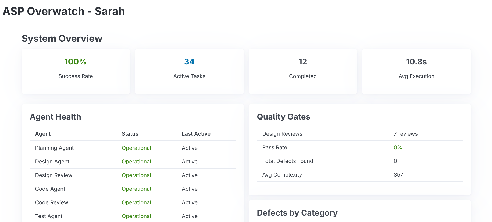
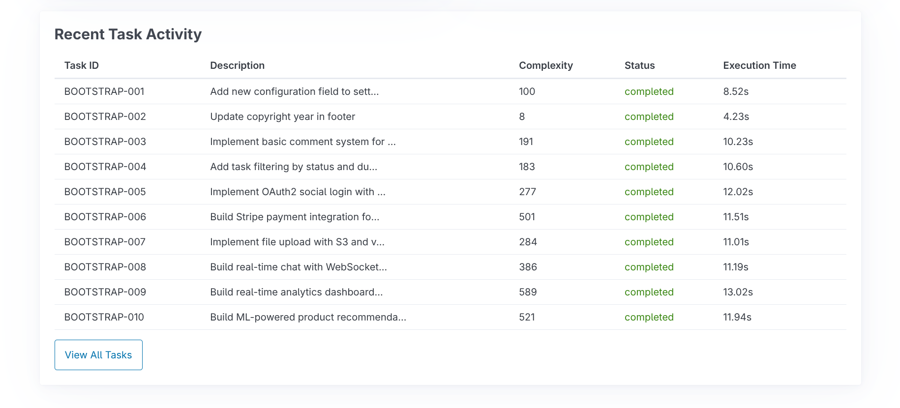

# UI Design Concept: ASP Overwatch (Engineering Manager)

**Persona:** Sarah, Director of Engineering
**Team Size:** 15 Developers (3 squads)
**Core Need:** "Sleep at night." (Visibility, Control, Quality Assurance)
**Design Philosophy:** "The Cockpit." Information dense but prioritized. Dark mode by default to reduce eye strain during incident response.

---

## Screenshots

### System Overview & Agent Health


*The ASP Overwatch dashboard shows system-wide metrics (100% success rate, 34 active tasks, 10.8s avg execution) and real-time agent health status for all 7 agents.*

### Recent Task Activity


*Detailed task activity view showing complexity scores, status, and execution times for each completed task.*

---

## 1. The Dashboard ("The Pulse")

A clean, high-level view of the entire engineering organization's health.

### Wireframe Layout

```text
+-----------------------------------------------------------------------+
|  ASP OVERWATCH   [Search Projects...]      (Sarah)  [Settings] [Log]  |
+-----------------------------------------------------------------------+
|  GLOBAL HEALTH       |  BUDGET (Month)     |  QUALITY INDEX           |
|  [ OK ] 98% Uptime   |  $1,240 / $2,000    |  [ A- ]  ▲ 2.4%          |
|  2 Critical Alerts   |  Avg Task: $0.45    |  Phase Yield: 87%        |
+-----------------------------------------------------------------------+
|                                                                       |
|  ACTIVE SQUADS (Card View)                                            |
|                                                                       |
|  +--------------------+  +--------------------+  +--------------------+
|  | Squad: Checkout    |  | Squad: Inventory   |  | Squad: Auth        |
|  | Status: [BUSY]     |  | Status: [IDLE]     |  | Status: [ALERT]    |
|  |                    |  |                    |  |                    |
|  | Agents Active: 4   |  | Agents Active: 0   |  | 🔴 Sec Review Fail |
|  | Cost: $12.50/hr    |  | Cost: $0.00/hr     |  | Ticket: AUTH-99    |
|  |                    |  |                    |  |                    |
|  | [||||||....]       |  | [..........]       |  | [||||||||||]       |
|  | (Code Gen Phase)   |  | (Waiting)          |  | (Blocked)          |
|  +--------------------+  +--------------------+  +--------------------+
|                                                                       |
+-----------------------------------------------------------------------+
|  RECENT ANOMALIES (AI Detected)                                       |
|  • [High Cost] Task PAY-402 used 4x avg tokens (Re-planning loop)     |
|  • [Quality]   Squad 'Checkout' skipped Design Review (Override)      |
+-----------------------------------------------------------------------+
```

### Key UI Features

*   **Traffic Light System:** Every card has a subtle glowing border (Green/Yellow/Red) indicating state.
*   **Sparklines:** Tiny graphs next to "Cost" and "Quality" showing the 30-day trend.
*   **"Drill-Down" Cards:** Clicking a squad card expands it into the "Squad View" without leaving the page (modal overlay).

---

## 2. The Deep Dive ("Phase Yield Analysis")

When Sarah needs to understand *why* velocity is slowing down.

### Wireframe Layout

```text
+-----------------------------------------------------------------------+
|  < Back to Dashboard      PHASE YIELD ANALYSIS: Q4                    |
+-----------------------------------------------------------------------+
|  FILTER: [Last 30 Days] [Squad: All] [Agent: All]                     |
+-----------------------------------------------------------------------+
|                                                                       |
|  THE PIPELINE VISUALIZATION (Sankey Diagram Flow)                     |
|                                                                       |
|  [Planning] ====> [Design] ====> [Code] ====> [Test] ====> [Deploy]   |
|     |               |              |            |                     |
|     v               v              v            v                     |
|  [Replan]        [Redesign]     [Refactor]   [Bug Fix]                |
|    5%              12%            8%           2%                     |
|                                                                       |
+-----------------------------------------------------------------------+
|  TOP DEFECT SOURCES (Pareto Chart)                                    |
|                                                                       |
|  |                                                                    |
|  |  [||||||||||] 40% Spec Ambiguity (Planning Agent)                  |
|  |  [|||||]      25% Race Conditions (Design Agent)                   |
|  |  [|||]        15% API Mismatches                                   |
|  |                                                                    |
+-----------------------------------------------------------------------+
|  RECOMMENDATIONS (Postmortem Agent)                                   |
|  > "High rate of Spec Ambiguity defects. Suggest increasing           |
|     Planning Agent 'Questioning' temperature to 0.7." [APPLY]         |
+-----------------------------------------------------------------------+
```

### Key UI Features

*   **Sankey Diagram:** Visualizes the "leakage" of effort. Thick lines mean smooth flow; arrows pointing down/backwards represent "waste" (re-work).
*   **One-Click Actions:** The Postmortem Agent doesn't just report; it offers an `[APPLY]` button to tweak system config (e.g., changing Agent prompts).

---

## 3. Cost Control Center ("The Receipt")

Detailed breakdown of AI spend.

*   **Visual:** Stacked bar chart showing cost per phase.
*   **Feature:** "Budget Cap". Sarah can set a slider: "Halt non-critical tasks if daily spend > $50."
*   **Vibe:** Fintech app style. Precise, numerical, trustworthy.

---

## Design Aesthetic
*   **Font:** Inter or Roboto Mono for data.
*   **Colors:** Deep Navy background (`#0f172a`), Neon accents for status (Cyan for active, Magenta for alert).
*   **Motion:** Smooth transitions. When a number changes, it rolls (odometer style).
