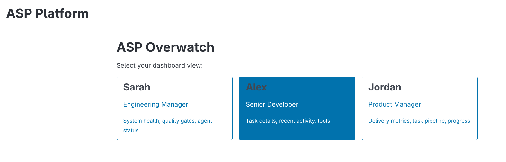

# ASP Web UI - Docker Guide

This guide explains how to run the ASP Platform Web UI using Docker.

## Overview

The ASP Web UI is a FastHTML-based dashboard that provides persona-specific views for:
- **Sarah** (Engineering Manager) - ASP Overwatch dashboard
- **Alex** (Developer) - Flow State Canvas
- **Jordan** (Product Manager) - Requirements Hub

### Role Selection


*The ASP Overwatch landing page allows users to select their role-specific dashboard view.*

For detailed UI documentation with additional screenshots, see:
- [Manager Overwatch UI](ui_designs/01_manager_overwatch.md)
- [Developer Flow Canvas UI](ui_designs/02_developer_flow_canvas.md)
- [Product Manager Prediction Engine UI](ui_designs/03_pm_prediction_engine.md)

## Prerequisites

- Docker 20.10+
- Docker Compose v2.0+

## Quick Start

### Production Mode

Run the Web UI on port 8000:

```bash
cd Process_Software_Agents
docker compose -f docker-compose.webui.yml up
```

Access the UI at: http://localhost:8000

### Development Mode

Run with live reload on port 8001 (source code changes apply automatically):

```bash
docker compose -f docker-compose.webui.yml --profile dev up
```

Access the dev UI at: http://localhost:8001

## Container Details

### Dockerfile.webui

The Web UI container is based on `python:3.12-slim` and includes:

| Component | Description |
|-----------|-------------|
| Base Image | `python:3.12-slim` |
| Framework | FastHTML + HTMX |
| Server | Uvicorn |
| Port | 8000 |
| User | Non-root (`asp`) |

### Build Arguments

Build the image manually:

```bash
docker build -f Dockerfile.webui -t asp-webui:latest .
```

### Run Standalone

```bash
docker run -d \
  --name asp-webui \
  -p 8000:8000 \
  -v $(pwd)/data:/app/data \
  asp-webui:latest
```

## Configuration

### Environment Variables

| Variable | Default | Description |
|----------|---------|-------------|
| `ASP_USER_ID` | `admin@asp-platform.local` | User ID for telemetry tracking |
| `PYTHONPATH` | `/app` | Python module path |

### Volumes

| Host Path | Container Path | Purpose |
|-----------|----------------|---------|
| `./data` | `/app/data` | Telemetry database persistence |
| `./src` (dev only) | `/app/src` | Source code for live reload |

## Services

### asp-webui (Production)

- **Port:** 8000
- **Features:** Optimized for production use
- **Data:** Persisted via volume mount

### asp-webui-dev (Development)

- **Port:** 8001
- **Features:** Live reload enabled
- **Profile:** Must be activated with `--profile dev`

## Health Checks

The container includes a health check that verifies the UI is responding:

```bash
# Check container health
docker inspect --format='{{.State.Health.Status}}' asp-webui
```

Health check configuration:
- Interval: 30 seconds
- Timeout: 10 seconds
- Retries: 3
- Start period: 10 seconds

## Troubleshooting

### Container won't start

Check logs:
```bash
docker compose -f docker-compose.webui.yml logs asp-webui
```

### Database not found

Ensure the `data` directory exists and contains `asp_telemetry.db`:
```bash
ls -la data/
```

If the database doesn't exist, the UI will show "No data available" messages but will still function.

### Port already in use

Change the port mapping in `docker-compose.webui.yml`:
```yaml
ports:
  - "8080:8000"  # Use port 8080 instead
```

## Integration with Multi-Persona Containers

For running multiple persona containers (as designed in `design/containerized_user_profiles.md`), see the future `docker-compose.profiles.yml` which will provide:

- `asp-sarah` - Engineering Manager container
- `asp-alex` - Developer container
- `asp-jordan` - Product Manager container
- `asp-admin` - Administrative container

## Related Documentation

- [Web UI Stack Proposal](proposals/web_ui_stack.md) - Technology decision
- [Containerized User Profiles](../design/containerized_user_profiles.md) - Multi-persona design
- [Telemetry User+LLM Tracking](../design/telemetry_user_llm_tracking.md) - Data tracked by the UI
